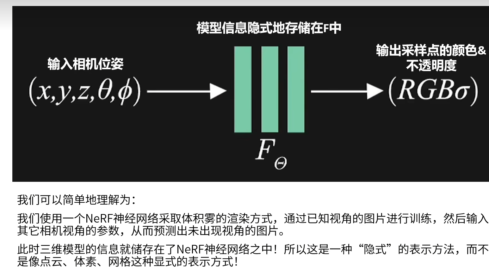
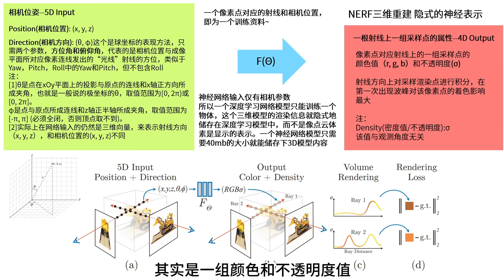
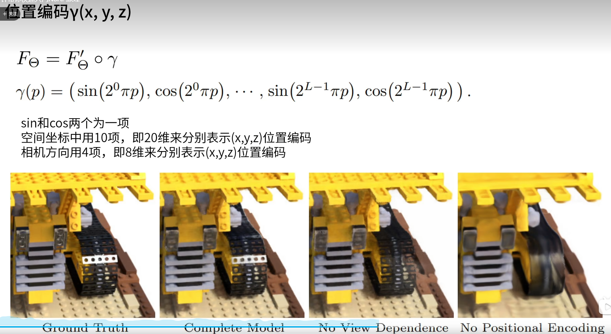
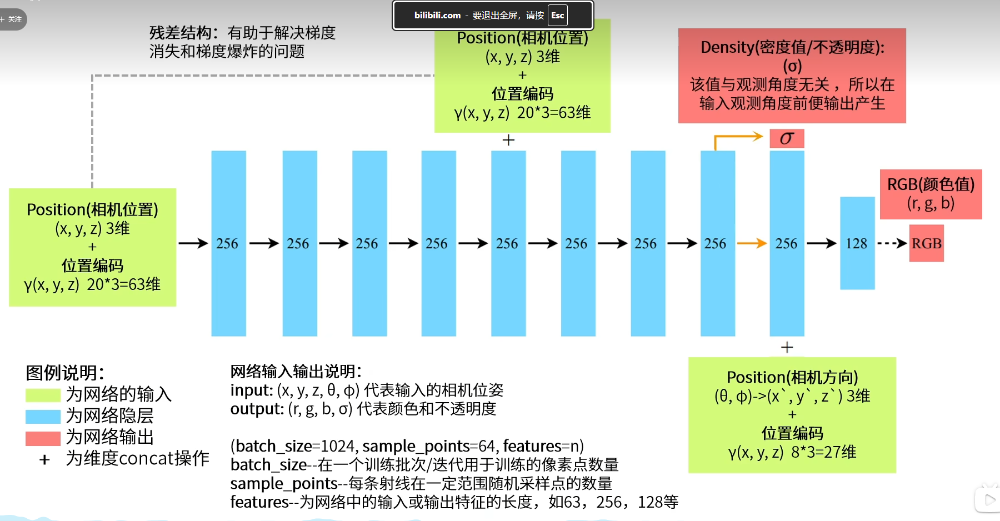
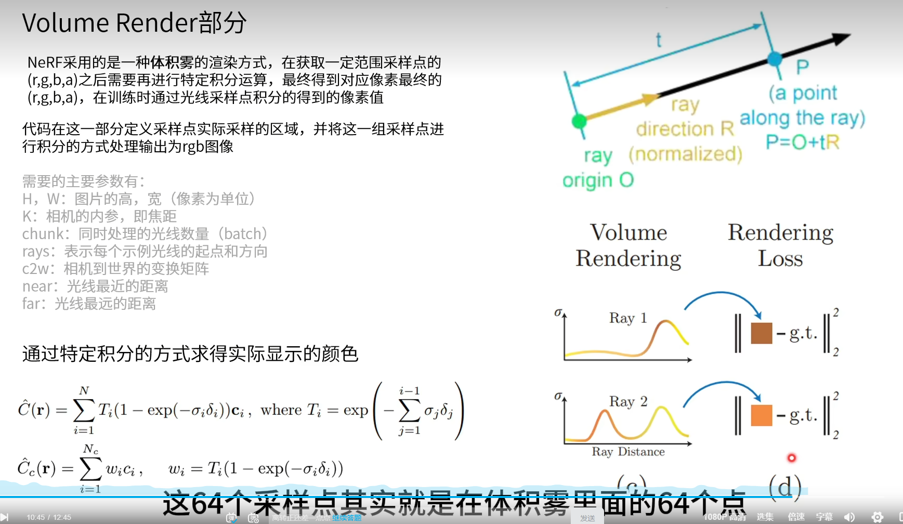
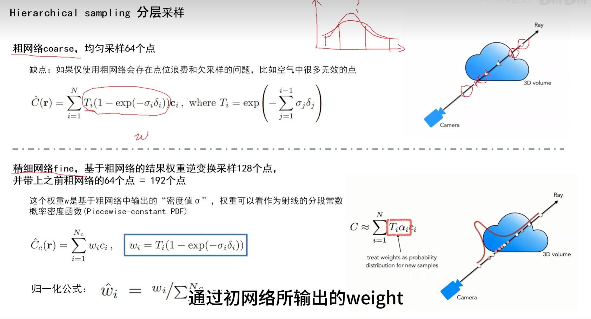

视频教学地址：https://www.bilibili.com/video/BV1o34y1P7Md/?spm_id_from=333.337.search-card.all.click&vd_source=17fc6f05fc7c43373231ec3626d3d7f0
一、原始论文（NeRF: Representing Scenes as Neural Radiance Fields for View Synthesis）
arXiv 论文（PDF）：https://arxiv.org/pdf/2003.08934.pdf
arXiv 摘要页：https://arxiv.org/abs/2003.08934
项目主页（含视频 / 数据）：https://www.matthewtancik.com/nerf
二、官方源代码（TensorFlow）
GitHub：https://github.com/bmild/nerf
三、主流 PyTorch 复现（推荐）
nerf-pytorch（忠实复现）：https://github.com/yenchenlin/nerf-pytorch
---
用途：三维重建，
神经网络使用体积雾的方式渲染

缺点：一个NeRF网络只能存储一个三维物体或三维信息场景。

位置编码参考傅里叶变化（认为一张图片是由多个明暗交错的频谱组合而成），将位置给了一组基函数让神经网络通过学习权重来学到在该位置下该如何用这些基函数叠加拼出图像。

第一个式子是理想状态下的情况，T是不透光率的函数。整个式子是将采样点的密度和影响范围累加起来。  
第二个式子是在有两个物体都是不透明。即使后面物体的波峰很高，由于被前一个物体挡住，也无需考虑。  
r函数代表只跟位置有关，跟角度无关。T函数代表只关注前面的不透明度，C代表颜色，跟位置、角度有关。

