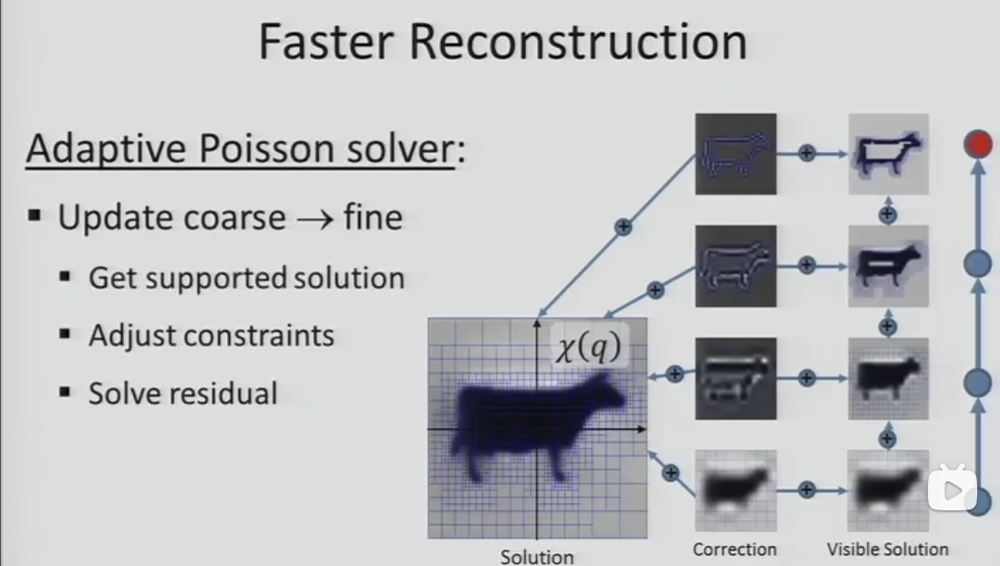

Poisson
原始论文：https://hhoppe.com/proj/poissonrecon/  
Open3D 教程：https://www.open3d.org/docs/latest/tutorial/Advanced/surface_reconstruction.html#Poisson-surface-reconstruction  
Screened Poisson（泊松改进版）  
论文：https://hhoppe.com/proj/screened/  
知乎：https://zhuanlan.zhihu.com/p/107653198#:~:text=%E6%B3%8A%E6%9D%BE%E9%87%8D%E5%BB%BA%E6%98%AF%E4%B8%80%E7%A7%8D%E9%9A%90%E5%BC%8F%E6%9B%B2%E9%9D%A2%E9%87%8D%E5%BB%BA%E6%96%B9%E6%A1%88%EF%BC%8C%E8%BE%93%E5%85%A5%E4%B8%BA%E4%B8%80%E7%BB%84%E7%89%A9%E4%BD%93%E8%A1%A8%E9%9D%A2%E7%9A%84%E6%9C%89%E5%90%91%E7%82%B9%E4%BA%91%EF%BC%8C%E8%BE%93%E5%87%BA%E7%89%A9%E4%BD%93%E8%A1%A8%E9%9D%A2%E4%B8%89%E7%BB%B4%E7%BD%91%E6%A0%BC%E3%80%82%20%E7%9B%B8%E6%AF%94%20%E5%BE%B7%E5%8A%B3%E5%86%85%20%E8%BF%99%E7%B1%BB%E7%9B%B4%E6%8E%A5%E7%BD%91%E6%A0%BC%E9%87%8D%E5%BB%BA%E7%9A%84%E5%8C%BA%E5%88%AB%E4%B8%BB%E8%A6%81%E5%9C%A8%E4%BA%8E%EF%BC%8C%E8%BE%93%E5%87%BA%E7%BD%91%E6%A0%BC%E7%9A%84%E9%A1%B6%E7%82%B9%E4%B8%8D%E9%9C%80%E8%A6%81%E6%9D%A5%E8%87%AA%E5%8E%9F%E5%A7%8B%E7%82%B9%E4%BA%91%EF%BC%8C%E7%BB%93%E6%9E%9C%E6%9B%B4%E5%B9%B3%E6%BB%91%EF%BC%8C%E5%B9%B6%E4%B8%94%E7%94%B1%E4%BA%8E%E5%85%A8%E5%B1%80%E6%B1%82%E8%A7%A3%EF%BC%8C%E5%8F%AF%E4%BB%A5%E4%BF%9D%E8%AF%81%E7%BD%91%E6%A0%BC%E7%9A%84%E6%B0%B4%E5%AF%86%E6%80%A7%E3%80%82,%E6%B3%8A%E6%9D%BE%E9%87%8D%E5%BB%BA%E5%9F%BA%E4%BA%8E%20%E6%9C%89%E9%99%90%E5%85%83%E6%96%B9%E6%B3%95%EF%BC%8C%E6%98%AF%E5%85%B8%E5%9E%8B%E7%9A%84%E2%80%9Coptimize%20then%20discretize%E2%80%9D%E7%9A%84%E6%80%9D%E6%83%B3%EF%BC%9A%E4%BB%8E%E8%83%BD%E9%87%8F%E6%9E%84%E5%BB%BA%E7%AD%89%E5%BC%8F%E6%96%B9%E7%A8%8B-%3E%E7%A6%BB%E6%95%A3%E5%8C%96%E5%9F%BA%E5%87%BD%E6%95%B0-%3E%E6%B1%82%E5%9F%BA%E5%87%BD%E6%95%B0%E7%B3%BB%E6%95%B0%EF%BC%8C%E6%9C%AC%E6%96%87%E4%B9%9F%E4%BC%9A%E4%BB%A5%E8%BF%99%E6%A0%B7%E7%9A%84%E9%A1%BA%E5%BA%8F%E5%B1%95%E5%BC%80%E3%80%82  
---
### 一、概述
**Screened Poisson Surface Reconstruction（SPR，筛选泊松表面重建）**，由Kazhdan & Hoppe于2013年提出，是对2006年经典泊松重建（PSR）的关键改进。核心是在泊松方程中加入**筛选项（Screening Term）**，把原纯插值问题转为**兼顾拟合、正则化与噪声鲁棒**的约束优化，显著减少过平滑，同时保持线性复杂度O(N)。
- **输入**：带**一致法向量**的定向点云（oriented point cloud）。
- **输出**：**水密、无孔洞、光滑**的三角网格。
- **核心优势**：抗噪声、保细节、效率高、支持大规模点云。


---

### 二、数学原理（从PSR到SPR）
#### 1. 经典泊松重建（PSR, 2006）
目标：求隐式指示函数$\chi$（表面内部≈1、外部≈0），使其梯度场匹配点云法向量场$\mathbf{V}$：
$$
\Delta \chi = \nabla\cdot\mathbf{V}
$$
- 缺点：**强插值、过度平滑**，对噪声敏感，易丢失细节。

#### 2. 筛选泊松重建（SPR, 2013）
引入**筛选项$\lambda S\chi$**，将方程转为**带约束的变分问题**：
$$
-\Delta \chi + \lambda S\chi = \nabla\cdot\mathbf{V}
$$
- $\lambda$：筛选强度，平衡**数据拟合**与**正则化**（越大越贴近点云、抗噪越弱）。
- $S$：筛选算子，**仅在输入点位置施加软约束**，鼓励等值面过点，非全域约束。
- 本质区别：**梯度约束在全空间，位置约束仅在点云处**，兼顾全局光滑与局部拟合。

#### 3. 变分形式（能量最小化）
SPR等价于最小化能量：
$$
\min_\chi \underbrace{\|\nabla\chi - \mathbf{V}\|^2}_{\text{拟合项}} + \underbrace{\lambda \sum_{p\in P} |\chi(p)|^2}_{\text{筛选项（位置约束）}}
$$
- 拟合项：让隐函数梯度匹配法向量场。
- 筛选项：让隐函数在点云处接近0（等值面），**抑制远离点云的波动**。

---

### 三、算法流程（5大步骤）
#### 1. 输入预处理：定向点云
- 输入：点集$P=\{(p_i,\mathbf{n}_i)\}$，需**单位法向量且方向一致**（内/外）。
- 预处理：法向估计（如PCA）、法向一致性传播（最小生成树/图割）、去离群点。

#### 2. 自适应八叉树构建
- 按指定*重建深度depth*（如8–12）构建八叉树，将点云划分到叶节点。
- 每个叶节点存储：平均位置、平均法向、点权重，实现**多分辨率自适应**。
- 优势：空区域不细分，**时间/空间复杂度线性O(N)**。

#### 3. 向量场构建
- 用**B样条基函数**（默认2次）在八叉树上插值点云法向，生成**连续向量场$\mathbf{V}$**。
- 每个点$(p_i,\mathbf{n}_i)$贡献局部向量场，加权“溅射”到邻域节点。

#### 4. 离散线性系统求解
- 泊松方程离散为**稀疏线性系统$A\mathbf{x}=\mathbf{b}$**，$\mathbf{x}$为隐函数系数。
- 用**多重网格法（Multigrid）**分层求解：粗层初始化→细层迭代优化，**高效收敛**。
- 筛选项转化为**点位置的软约束**，集成到线性系统，不增加复杂度。

#### 5. 等值面提取（Marching Cubes）
- 求解隐函数$\chi$后，提取**$\chi=0.5$等值面**（表面边界）。
- 用**移动立方体（Marching Cubes）**生成三角网格，输出PLY格式。

---

### 四、关键参数与作用
| 参数 | 作用 | 典型值 |
|---|---|---|
| `--depth` | 八叉树最大深度，控制分辨率 | 8–12（越高越细、越慢） |
| `--lambda` | 筛选强度，平衡拟合与光滑 | 1–10（越大越贴点云） |
| `--degree` | B样条次数，控制光滑度 | 2（默认）、3 |
| `--samplesPerNode` | 每节点最大采样数，抗噪 | 4–8 |
| `--linearFit` | 线性插值等值面，减少锯齿 | 开启/关闭 |

---

### 五、SPR vs PSR：核心差异
- **过平滑**：PSR严重；SPR显著减轻，**保细节更好**。
- **噪声鲁棒**：PSR敏感；SPR通过筛选项**抑制噪声**，适配5%–15%高斯噪声。
- **边界处理**：PSR用Dirichlet边界（易闭合过早）；SPR支持Neumann边界，**表面延伸到域边界**。

- **效率**：均为O(N)，SPR求解**仅小幅增加开销**。

---

### 六、优缺点
#### 优点
1. **水密无孔洞**：隐式重建天然保证封闭，无需后处理补洞。
2. **抗噪声/离群点**：筛选项与多分辨率结构适配扫描噪声。
3. **细节保持**：比PSR更能保留尖锐特征（边缘、棱角）。
4. **高效大规模**：线性复杂度，可处理千万级点云。
5. **全局光滑**：隐式场保证网格质量，无局部扭曲。

#### 缺点
1. **依赖法向质量**：法向不一致会导致重建失败或拓扑错误。
2. **参数敏感**：深度、λ需调优，高分辨率耗时增加。
3. **均匀密度偏好**：点云稀疏区域易平滑过度，密集区域细节好。

---

### 七、实现与工具
- **官方开源**：Kazhdan的PoissonRecon（C++，含SPR）。
  ```bash
  # 典型命令
  PoissonRecon --in input.ply --out output.ply --depth 10 --lambda 5
  ```
- **第三方封装**：
  - Python：`pyvista`、`open3d`（集成SPR）。
  - Rust：`fslabs/poissonreconstruction`。
  - MATLAB：`Poisson Surface Reconstruction Toolbox`。

---

### 八、应用场景
- **三维扫描重建**：文物、雕塑、逆向工程（斯坦福兔子、龙模型）。
- **摄影测量**：多视图立体匹配（MVS）点云网格化。
- **医学影像**：CT/MRI点云重建器官表面。
- **机器人感知**：场景重建、SLAM地图网格化。

---

### 九、总结
**筛选泊松重建（SPR）**通过引入**点位置筛选项**，在**全局光滑**与**局部拟合**间取得平衡，解决了经典泊松重建的过平滑问题，同时保持高效率与水密性。它是当前**点云网格化的主流算法**，广泛用于三维重建、逆向工程与医学影像等领域。
